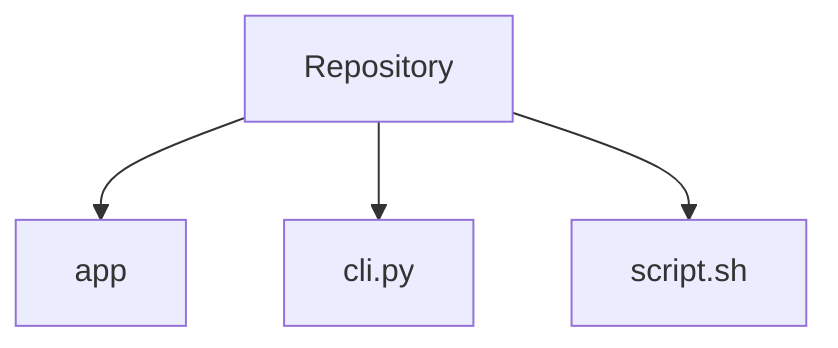
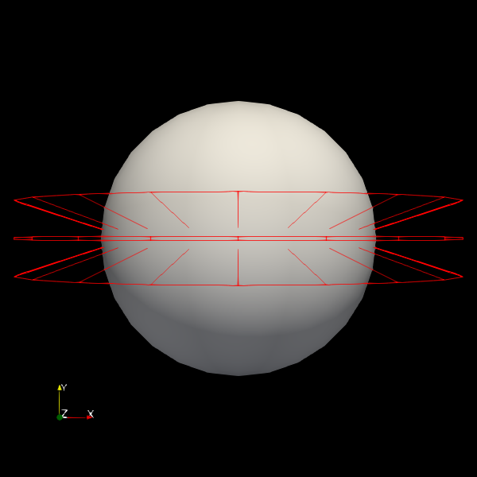
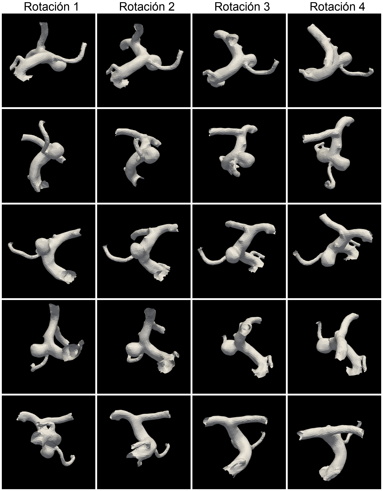
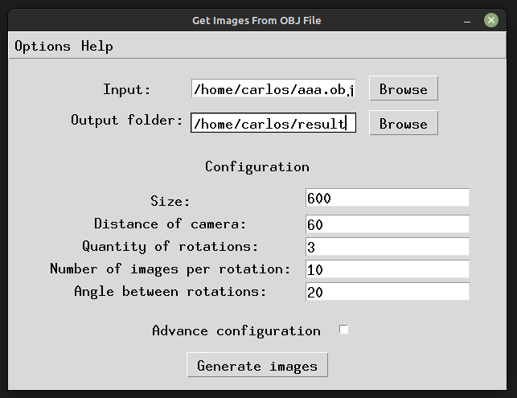
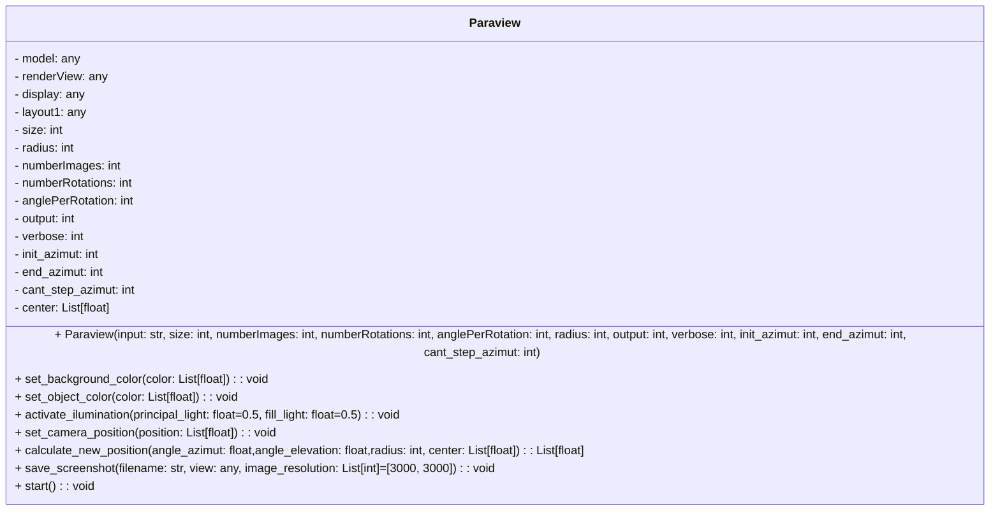

# Get Images from OBJ

This repository contains application to retrieve images from .OBJ files. It's free licence and free use.

## Technologies
- Python (Tkinter, black, flake8)
- CI/CD (Github Actions)
- Testing (unittest)

## Entry points
It contains application to use it with GUI, a CLI to use it by terminal and a script to avoid boilerplate of settings params by terminal.


## Set up
To use GUI download already bundle app in release section for your OS. To use from terminal, by script or CLI, clone repo and execute what you need:

For CLI:
 ```bash 
pvpython cli.py --input "/home/.../small.obj" --output "/home/.../results" --size 600 --numberRotations 3 --numberImages 10 --anglePerRotation 20 --distanceOrRadio 60 --initMovement 0 --endMovement 90 --cantStepMovement 2
  ```

For script, define params in cli.sh, then run it :
```bash 
bash cli.sh
  ```

## Paraview Installation
To run any entry point of this repo must have installed Paraview, and use *pvpython* inside bin folder (where Paraview is download and decompress) to run the script.

[Download Paraview](https://www.paraview.org/download/)

For app must have pvpython path added to PATH else won't work. For CLI and script it's a recommendation else use absolute path to pvpython.

## How it works
*--input* is the absolute path to the .obj file, and *--ouput* is the folder where images will be save.



When defining *--numberRotations* *--numberImages*  *--anglePerRotation*, the rotations are the rings in diagram above, the angles per rotations are the angle of inclination between rings, and the number of images are how many captures are taken in each rotation. For the diagram we see *--numberRotations 3* *--numberImages 20*  *--anglePerRotation 20*

### Advance Params
When needs to take a sequence of images from rotation but starting from diferent points, could use *--initMovement* *--endMovement* *--cantStepMovement*. It defines an angle from init movement to end movement and the quantity of steps (starts points to take the sequence of images). 
Use Case example: when you have to take four images of object, in differents angles, using *--initMovement 0* *--endMovement 90* *--cantStepMovement 10* for each rotation can generate nine more data.

### Params

``` txt
--input -> Path to .obj input file.
--output -> Path directory to store images of .obj file.
--size -> Images size, square output.
--numberImages -> Quantity of images per rotation.
--numberRotations -> Quantity of ratations.
--anglePerRotation -> Angle difference between two rotations. In °.
--distanceOrRadio -> Distance between camera and object.
--initMovement -> The angle where starts the movement for each rotation.
--endMovement -> The angle where ends the movement for each rotation.
--cantStepMovement -> The quantity of movements between angles defined in movement.
--verbose -> Show info of steps.
```

## Examples
In the example below it's a result of four rotations at 20° angle between them, 4 images per rotation, default values to advance params (only one movment).



## App preview



## Class Diagram For Paraview implementation


