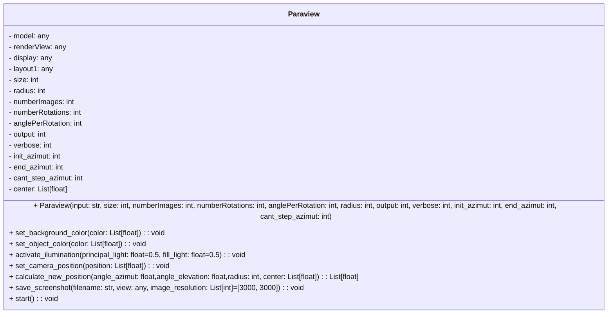
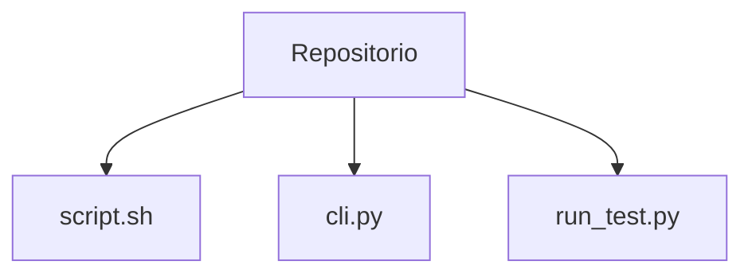

# Get images from .OBJ file

This repo contains script to retrieve, with paraview, a sequence of images from .obj object file. 

## How it works

The scripts recive several params, Rotates the object for *--numberRotations* and each rotation is spaceing by *--anglePerRotation*. The rotations is over the y axis. Each rotation starts to take *--numberImages* images equally distributed over the axis. And for the movement, normally to obtain more data when using 4 as *--numberImages*, setting 0° to 90° by 10° the movement, this enables us to get more view angles.

``` txt
--input -> Path to .obj input file.
--output -> Path directory to store images of .obj file.
--size -> Images size, square output.
--numberImages -> Quantity of images per rotation.
--numberRotations -> Quantity of ratations.
--anglePerRotation -> Angle difference between two rotations. In °.
--distanceOrRadio -> Distance between camera and object.
--initMovement -> The angle where starts the movement for each rotation.
--endMovement -> The angle where ends the movement for each rotation.
--cantStepMovement -> The quantity of movements between angles defined in movement.
--verbose -> Show info of steps.
```

## Paraview Installation

Must have installed Paraview, and use *pvpython* inside bin to run the script. 
This enable python to access paraview API.

Download Paraview from (link)[https://www.paraview.org/download/]

*Recommend to add bin folder to PATH* else must use absolute path to pvpython!

## Class Diagram



## Entry points

